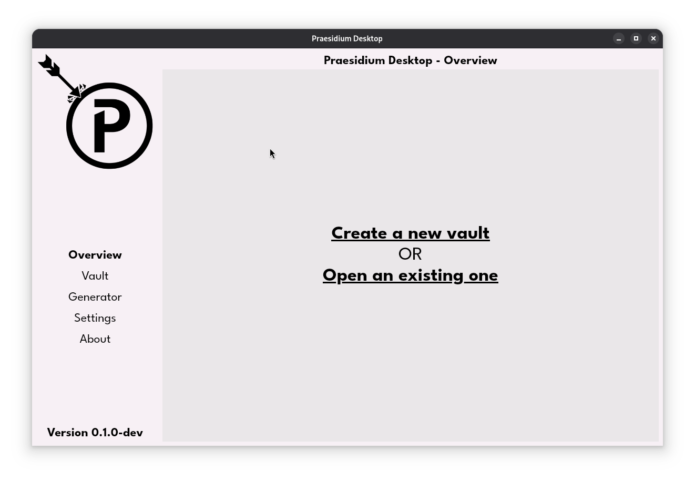
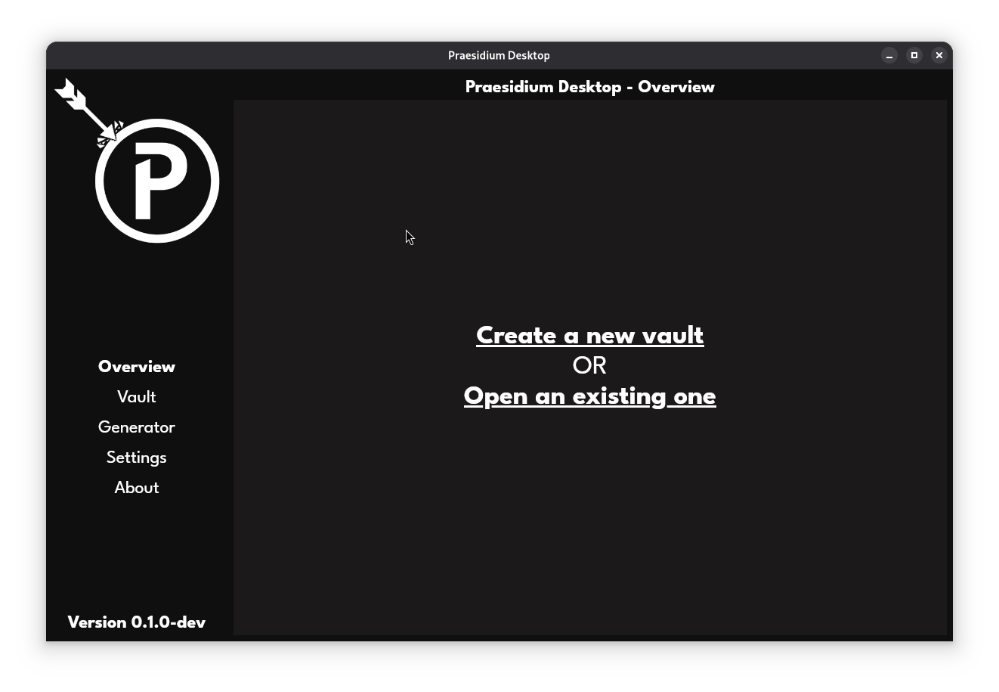

# Praesidium
Praesidium is yet another password vault app, it aims to be simple and straightforward

## Preview

## Features
- __Cross-platform__ -> Uses the target OS WebView, achieving a uniform GUI and portability
- __Password generation__ -> Easily generate a strong password with the built-in generator
- __OpenSSH keys__ -> Generate, manage, copy and export OpenSSH keys without losing your mind
- __Secure__ -> Vaults are encrypted by default with strong algorithms, keeping your secrets
safe even if the vault gets compromised

## Repositories
- [desktop](https://github.com/PraesidiumApp/desktop) -> The desktop version of Praesidium
- [engine](https://github.com/PraesidiumApp/engine) -> The backbone of Praesidium, manages vaults and data encryption
