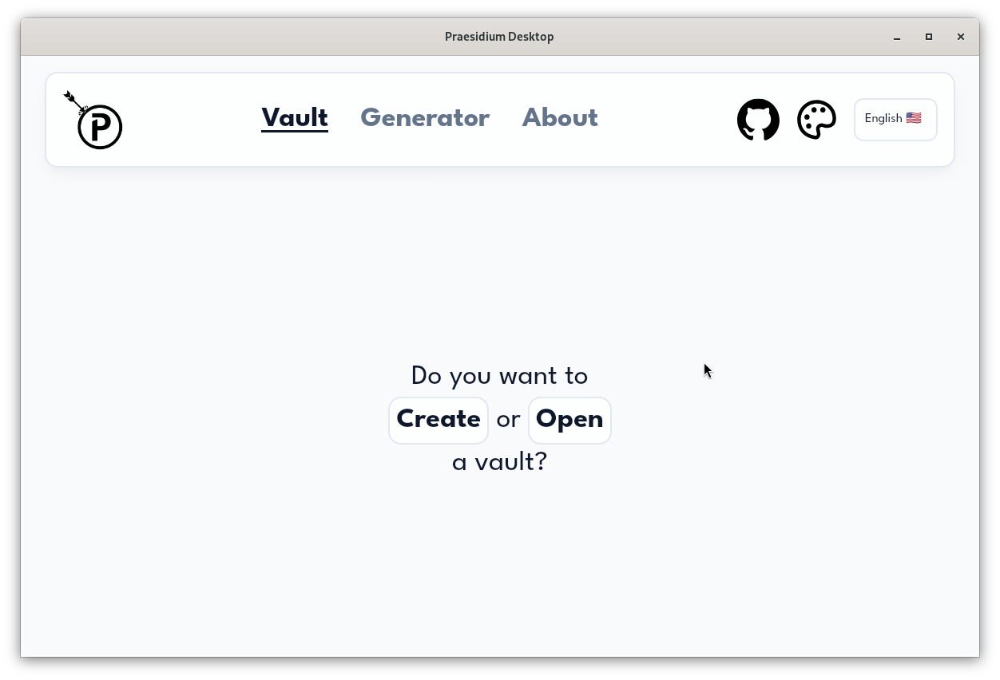
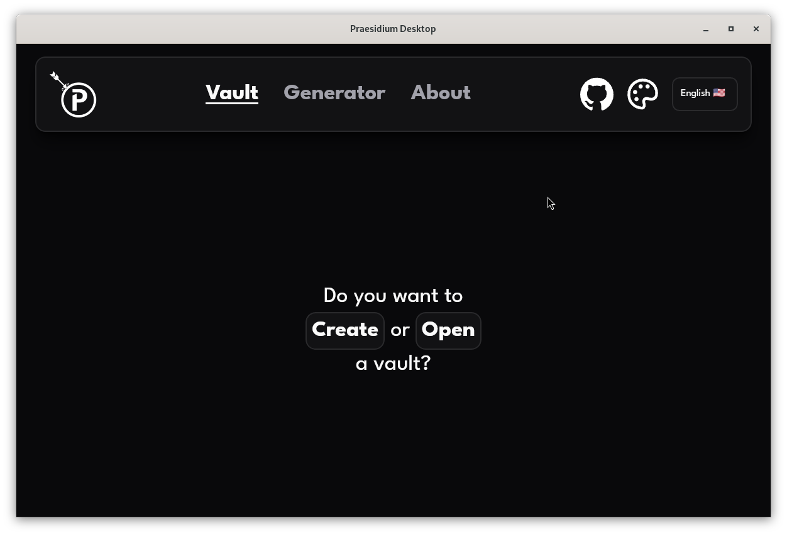

# Praesidium

## About
Praesidium is a lightweight, cross-platform credential manager  
Create a vault, set your master password, and store your sensitive data securely  
Praesidium handles the heavy lifting

> [!CAUTION]
> **Research project:** This application was built for research purposes, use it at your own risk

## Features
* **Cross-platform:** Utilizes the target OS WebView for a consistent, good-looking user interface
* **Password Generator:** Built-in tool to easily create passwords on the fly
* **Industry-Standard Security:**
	* **Key Derivation:** Argon2id
    * **Encryption:** AES-256-GCM

## Screenshots

